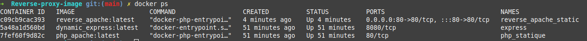
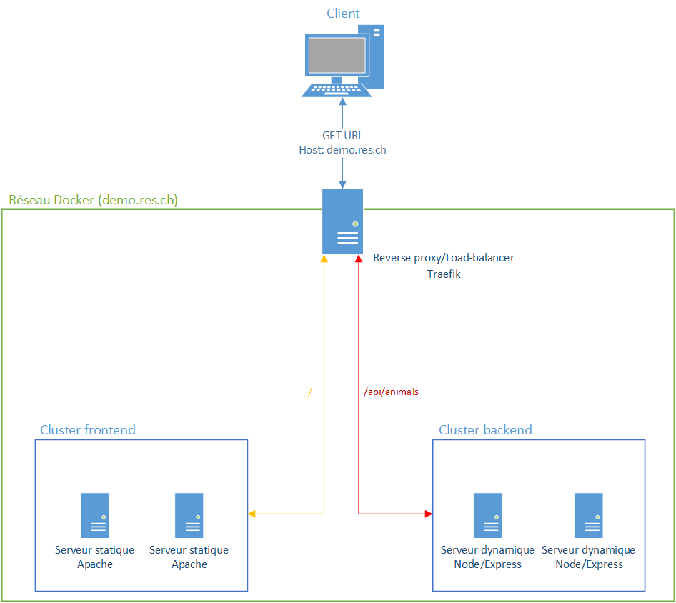
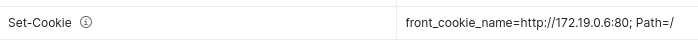
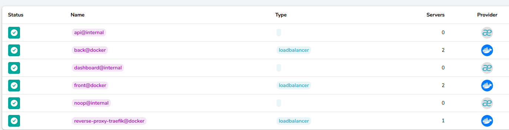

# RES_Labo_HTTPInfra

Rapport du laboratoire sur l'infrastructure HTTP. Cette documentation incrémentale détaille la construction de
l'infrastructure par étape.

Auteurs : Léonard Besseau, Nicolas Ogi

Date : 27.05.2021

___

**IMPORTANT**: 
Le fichier host doit être modifié pour rediriger demo.res.ch vers localhost.

## Étape 1 : Static HTTP server with apache httpd

### But

Le but de cette étape consiste à configurer et déployer un serveur HTTP statique utilisant *Apache* à l'aide d'une image 
Docker récupérée sur Docker Hub.

### Images utilisées

[php:8.0.6-apache](https://hub.docker.com/_/php) : Nous utilisons l'image Docker *php* comme base dans notre Dockerfile 
car elle dispose déjà d'un serveur Apache configuré pour fournir des pages PHP.

Tous les fichiers contenus dans le dossier `content` sont copiés dans le conteneur lors du build, dans le dossier `/var/www/html`.
Le template bootstrap utilisé pour la page d'accueil peut être trouvé [ici](https://startbootstrap.com/theme/agency).

Les fichiers de configuration d'*Apache* à l'intérieur conteneur situé dans le dossier `/etc/apache2` n'ont pas été modifiés.

### Commandes
Voici les commandes pour construire l'image à partir du Dockerfile et ensuite lancer un conteneur.

`docker build -t php_apache .` Construit une image nommée *php_apache*.

`docker run -p 2001:80 --name php_statique -d php_apache:latest` Démarre un conteneur portant le nom *php_statique* 
 en arrière-plan en mappant le port 2001 de l'hôte sur le port 80 du conteneur.

`docker exec -it php_statique /bin/bash` Lance un shell sur le conteneur.

## Étape 2 : Dynamic HTTP server with express.js

### But

Le but de cette étape consiste à configurer et déployer un serveur HTTP dynamique utilisant *Express* à l'aide d'une image
Docker récupérée sur Docker Hub.

### Images utilisées

[node:14.16.1](https://hub.docker.com/_/node) : Nous utilisons l'image Docker *node* comme base dans notre Dockerfile
car l'environnement *nodeJS* y est déjà installé et nous permet d'installer facilement les dépendances de notre serveur et de le lancer.

Tous les fichiers contenus dans le dossier `src` sont copiés dans le conteneur lors du build, dans le dossier `/opt/app/`. 
Les dépendances sont installées à l'aide de *npm* (Commande `RUN npm install`).
Le serveur est lancé au démarrage du conteneur avec la commande `node index.js` qui va permettre à ce dernier d'écouter sur le port
défini dans le Dockerfile ou sur le port 3000 si rien n'a été défini.

Le fichier *index.js* gère un serveur HTTP avec *Express* et retourne une liste d'animaux avec leur pays d'origine
actuel et leur prix, en JSON. Le module *chance* a été utilisé afin de générer aléatoirement cette liste d'animaux.

Il est possible de préciser le port qu'utilisera le serveur dans le Dockerfile (Variable d'environnement `PORT`). 
La configuration du serveur *Express* est celle par défaut.

### Commandes
Voici les commandes pour construire l'image à partir du Dockerfile et ensuite lancer un conteneur.

`docker build -t dynamic_express .` Construit une image nommée *dynamic_express*.

`docker run -p 2002:8080 --name express -d dynamic_express:latest` Démarre un conteneur portant le nom *express*
en arrière-plan en mappant le port 2002 de l'hôte sur le port 8080 du conteneur.

## Étape 3 : Reverse proxy with apache (static configuration)

### But

Le but de cette étape consiste à configurer et déployer un reverse proxy devant un serveur HTTP dynamique et 
un serveur HTTP statique, en utilisant *Apache* à l'aide d'une image Docker récupérée sur Docker Hub. Ceci nous permet de 
respecter la Same-Origin policy.

### Images utilisées

- [node:14.16.1](https://hub.docker.com/_/node) : Serveur dynamique (Défini à l'étape 2)
- [php:8.0.6-apache](https://hub.docker.com/_/php) : Serveur statique (Défini à l'étape 1)
- [php:8.0.6-apache](https://hub.docker.com/_/php) : Reverse proxy. Nous utilisons l'image *php* car *Apache* y est 
  déjà configuré et nous pouvons utiliser les commandes (`a2enmod`, `a2ensite`, etc.) pour activer les modules nécessaires à un reverse proxy, 
  ce qui n'était pas possible avec l'image [httpd](https://hub.docker.com/_/httpd/) (Les commandes étaient désactivées). 

Setup pour les serveurs est le même que précédemment.

On lance les 2 serveurs sans les binders à un port de la machine. On regarde les adresses attribuées
avec `docker inspect <Container-name> | grep -i ipaddress` et on les précise dans ***001-reverse-proxy.conf***.

La configuration est fragile car les adresses IP des serveurs sont allouées dynamiquement et peuvent donc changer ce qui
implique de modifier les fichiers de configuration et de relancer le reverse proxy.



Le seul conteneur accessible est le `reverse_apache_static` car il est le seul avec des ports mappés vers l'extérieur.

### Commandes
Voici les commandes pour construire l'image à partir du Dockerfile et ensuite lancer un conteneur.

`docker build -t reverse_apache .` Construit une image nommée *reverse_apache*.

`docker run -p 80:80 --name reverse_apache_static -d reverse_apache:latest` Démarre un conteneur portant le nom *reverse_apache_static*
en arrière-plan en mappant le port 80 de l'hôte sur le port 80 du conteneur.

## Étape 4 : AJAX requests with JQuery

### But

Le but de cette étape consiste à modifier le serveur statique afin qu'il récupère la liste d'animaux générée aléatoirement 
par le serveur dynamique et en affiche un. 

### Images utilisées

- [node:14.16.1](https://hub.docker.com/_/node) : Serveur dynamique (Défini à l'étape 2)
- [php:8.0.6-apache](https://hub.docker.com/_/php) : Serveur statique. Essentiellement la même qu'à l'étape 1 mais 
  avec un script supplémentaire dans les sources.
- [php:8.0.6-apache](https://hub.docker.com/_/php) : Reverse proxy (Défini à l'étape 3)

Même config qu’avant. Les requêtes sont bien envoyées par le navigateur (vérifié avec les devs-tools)
Le reverse proxy est essentiel à cause de la Same-Origin Policy qui oblige à ce que les requêtes viennent du même
serveur.

Les requêtes vers le serveur dynamique sont gérées par un script JQuery situé dans `content/js/animals.js`. 
Une nouvelle requête est effectuée toutes les 2 secondes.

### Commandes
Voici les commandes pour construire l'image à partir du Dockerfile et ensuite lancer un conteneur.

`docker build -t ajax .` Construit une image nommée *ajax*.

`docker run --name monsieur_propre -d ajax:latest` Démarre un conteneur portant le nom *monsieur_propre* en arrière-plan.

## Étape 5

### But

Le but de cette étape consiste à modifier le reverse proxy afin que les adresses IP des serveurs soient obtenues de manière dynamique.

### Images utilisées

- [node:14.16.1](https://hub.docker.com/_/node) Serveur dynamique (Défini à l'étape 2)
- [php:8.0.6-apache](https://hub.docker.com/_/php) : serveur statique (Défini à l'étape 4)
- [php:8.0.6-apache](https://hub.docker.com/_/php) : reverse proxy. Similaire à l'étape 3

Les images utilisées sont les mêmes qu'auparavant mais nous utilisons `docker-compose` pour simplifier la création des
conteneurs et du réseau. Nous n'avons pas utilisé la solution proposée mais avons profité du fait que les réseaux
Docker créés par un utilisateur permettent la résolution dynamique des noms de
conteneurs [[1]](https://docs.docker.com/network/bridge/#differences-between-user-defined-bridges-and-the-default-bridge)
. Nous n'avons donc pas besoin de nous occuper de récupérer les adresses IP d'un quelconque conteneur et pouvons lancer
tous les conteneurs en une seule commande.

### Commandes
Toutes les images des étapes précédentes doivent être construites avec la commande `docker build` avant de lancer la commande
ci-dessous.

`docker-compose up -d` : Démarre en arrière-plan l'infrastructure contenant les serveurs statique et dynamique ainsi que le reverse proxy

## Étapes additionnelles

### Schéma d'infrastructure


### Images utilisées :

- [node:14.16.1](https://hub.docker.com/_/node) Serveur dynamique (Défini à l'étape 2 mais modifié pour retourner un uid sur une des routes)
- [php:8.0.6-apache](https://hub.docker.com/_/php) : Serveur statique (Défini à l'étape 4)
- [php:8.0.6-apache](https://hub.docker.com/_/traefik/) : Reverse proxy. Nous utilisons *Traefik* 
  pour implémenter le load-balancing, les sticky-sessions et l'ajout dynamique de conteneur dans les clusters. 
  

### Reverse Proxy
La configuration du reverse proxy est définie à l'aide de labels dans le fichier `docker-compose.yaml`.
Le reverse proxy expose le port 80 pour le trafic destiné aux serveurs dont il est en charge.

Les routes sont définies avec les labels traefik.http.routers.CLUSTER.rule=RULE où CLUSTER est le cluster vers lequel 
rediriger le trafic et RULE la règle que doit respecter la requête pour être redirigés
**Exemple**
- Host(`demo.res.ch`) && PathPrefix(`/api/animals/`), pour le back end, où la route doit commencer par `api/animals/` pour que la requête soit redirigée.
- Host(`demo.res.ch`), pour le front end, où toutes les requêtes pour `demo.res.ch` qui ne respectent pas la règle précédente seront redirigées vers le front end.

Les requêtes vers le back end doivent également être modifiées car le serveur attend que la requête se fasse sur la racine et l'URL doit être modifiée pour y retirer le préfixe.
```
- traefik.http.routers.back.middlewares=back-stripprefix
- traefik.http.middlewares.back-stripprefix.stripprefix.prefixes=/api/animals/,/api,/api/,/api/animals
- traefik.http.middlewares.back-stripprefix.stripprefix.forceslash=false
```
Avec les commandes ci-dessus, on enregistre un middleware pour modifier l'URL et enlever le `/api/animals` avant de transmettre la requête au serveur.

Le reverse proxy expose également une interface de monitoring sur le port 8080, qui permet de visualiser les conteneurs en activité.


### Load balancing: multiple server nodes
Le load-balancer fonctionne en round-robin. Il y a 2 clusters de serveurs qui sont gérés, un pour la partie
statique et l'autre pour la partie dynamique.

Pour vérifier son fonctionnement, nous avons modifié l'implémentation du serveur dynamique pour retourner un uid qui est
fixé à la création du serveur. En effectuant des requêtes, on peut voir que l'uid change à chaque requête (de façon
périodique selon le nombre de serveurs créés).

La configuration pour le load balancing est définie avec les labels `traefik`:
- traefik.http.services.CLUSTER.loadbalancer.server.port=PORT où CLUSTER est le cluster concerné (front end ou back end) et PORT est le port que les conteneurs exposent.

### Load balancing: round-robin vs sticky sessions
Le load balancer fonctionne en round-robin comme démontré précédemment en assurant que les requêtes du client sont envoyées à un serveur différent à chaque fois.
Les sticky sessions permettent de s'adresser au même serveur pour toute une session (si le site comporte une partie authentifiée par exemple). 
On peut voir que la réponse de la première requête adressée au serveur statique contient un header Set-Cookies avec l'IP du serveur et le path. 
Si le client précise ce cookie dans sa requête suivante, il continuera à échanger avec le même serveur. 

Exemple de réponse du serveur avec `Set-Cookie`:



La configuration pour le sticky session est définie avec les labels `traefik`:
- traefik.http.services.front.loadBalancer.sticky.cookie=true, pour activer le sticky session
- traefik.http.services.front.loadBalancer.sticky.cookie.name=front_cookie_name, pour définir le nom du cookie

### Dynamic cluster management
A l'aide de *Traefik*, nous pouvons ajouter de façon dynamique et simple, des conteneurs dans les clusters. Pour cela, 
il suffit de préciser le nombre d'instances souhaitées avec `docker-compose` et l'option `--scale`
**Example**
`docker-compose up -d --scale front=2 --scale back=3` pour définir une configuration composée de 2 serveurs statiques et 3 serveurs dynamiques.


### Management UI
Avec *Traefik*, il est possible de visualiser facilement le nombre de conteneurs actifs mais pas de modifier la configuration actuelle.
Example d'une configuration avec 2 serveurs statiques et 2 serveurs dynamiques.


Nous avons essayé *Portainer* pour modifier la configuration en temps réel depuis une interface Web. Cela fonctionne mais ce n'est pas très 
ergonomique ni intuitif et avons décidé de ne pas accorder plus de temps à cette partie.
